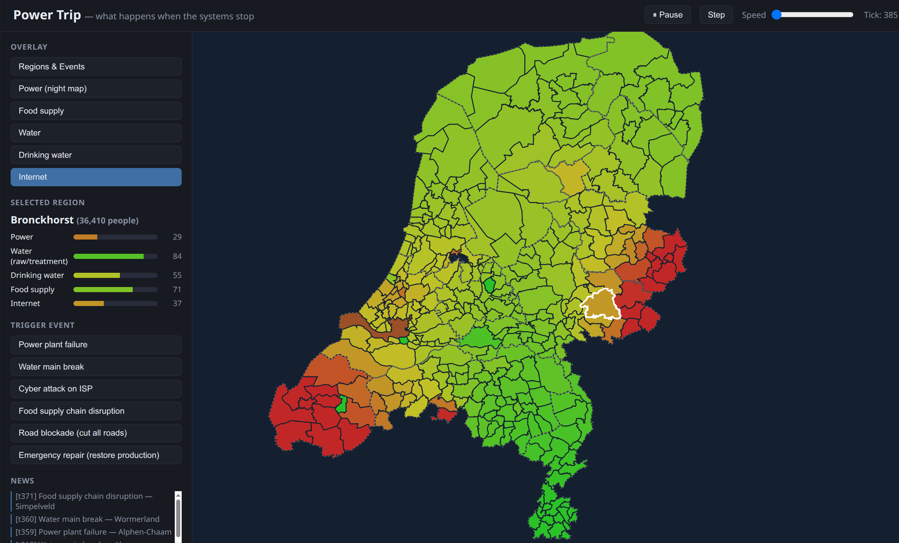

# Power Trip

A static, no-build web app simulating cascading infrastructure failure across all 342 Dutch municipalities (gemeenten). Power goes out somewhere — and you watch it spread.

## What it does

Simulates cascading failure of 5 resources (power, water, drinking water, food, internet) across a tiled map of the Netherlands. Regions are connected by shared-border adjacency (934 edges), not hand-picked motorway corridors. Healthy neighbors prop up failing ones — at a cost to themselves.

A power plant failure triggers cascading water/food/internet outages that spread across the map over ~5 minutes of real time.

## Running it

No build step. No dependencies. Just open `index.html` in a browser — `file://` works.

## Architecture

Plain HTML/SVG/JS. Load order matters: `boundaries.js` → `provinces.js` → `geo.js` → `data.js` → `sim.js` → `app.js`.

- **`sim.js`** — pure simulation engine, no DOM knowledge
- **`data.js`** — static region metadata, road edges, event definitions
- **`boundaries.js`** — generated from PDOK data, not hand-edited
- **`provinces.js`** — generated province outlines (reference overlay only)
- **`geo.js`** — equirectangular projection into SVG viewBox
- **`app.js`** — SVG rendering + UI wiring
- **`style.css`** — visual styling

## Simulation model

Each region tracks 5 resources (0–100). Healthy baseline: production equals consumption. Two mechanics drive the cascade:

- **Diffusion** — each tick, stock drifts toward intact-road neighbors' stock
- **Cascade rule** — power below 20 throttles drinking water production and degrades internet before cutting out

Events (plant failures, road blockades, ISP outages, repairs) are applied via `applyEvent()` in `sim.js`, keeping the simulation engine separate from rendering for future extensibility.
